# 식당 예약 프로그램

## 소개
- Java로만 구현한 프로그램
- Java와 MVC 패턴, Sington 등에 대해 공부할 수 있었음
- 음식 메뉴 선택에 어려움이 있는 사람들에게 도움을 주기 위한 프로그램
- 음식 선택과 더불어 등록된 식당 예약을 할 수 있도록 구현

## ERD
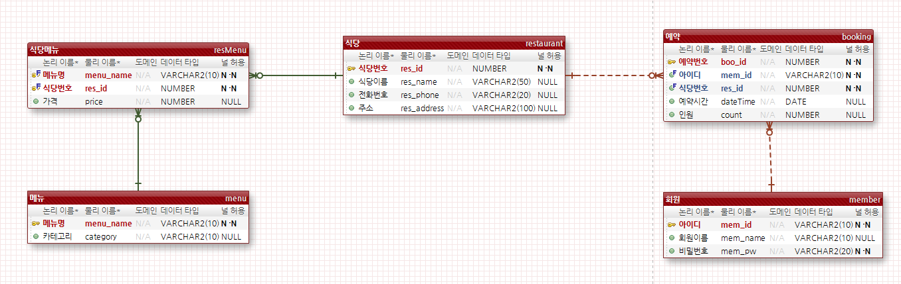

## Class Diagram
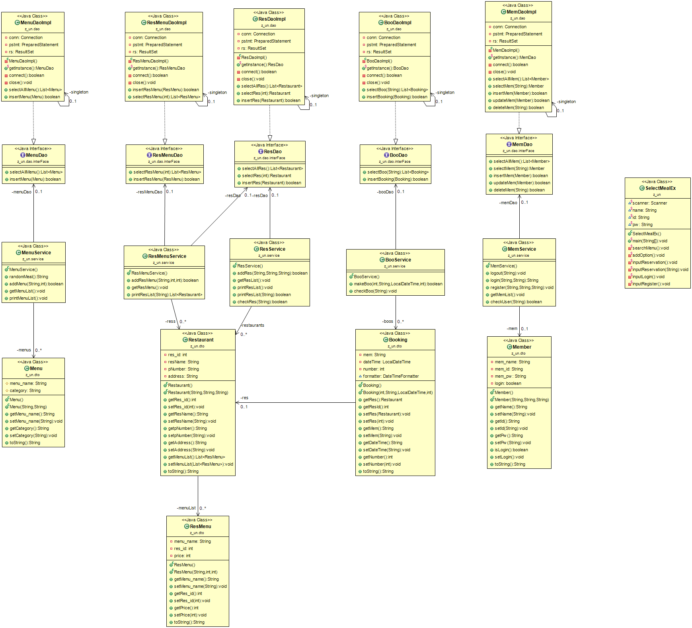

## 구현 결과
### 초기 화면
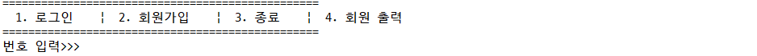
- 회원 가입
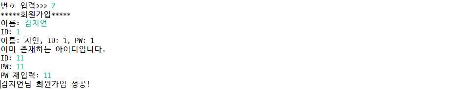
- 로그인
  - 로그인 오류
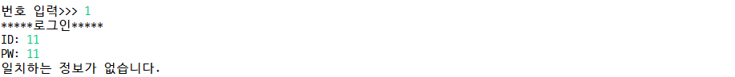
  - 로그인 성공
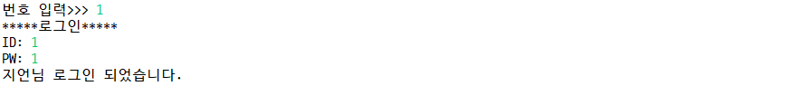
- 로그아웃

- 종료

- 회원 목록

### 메인 화면
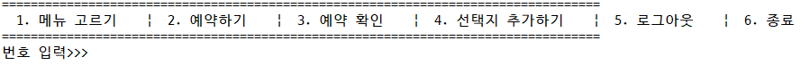
- 메뉴 고르기
  - 랜덤으로 선택하기

  - 직접 선택하기
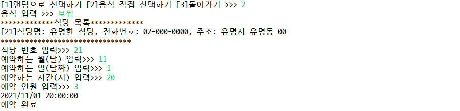
- 예약하기
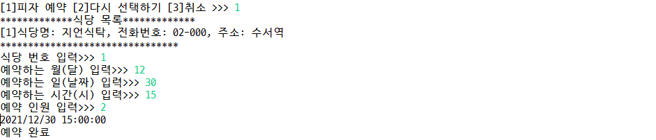
- 예약 확인

- 선택지 추가하기
  - 랜덤 음식 추가
  
  - 식당 추가
  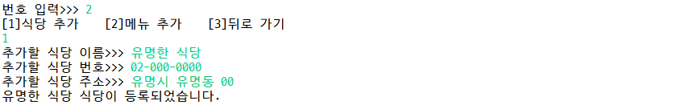
  - 식당 메뉴 추가
  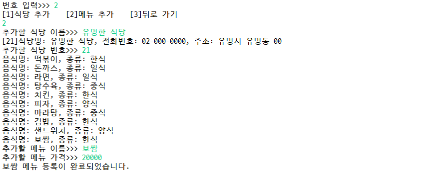
